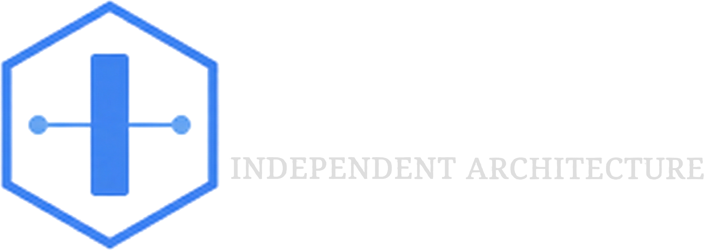

<div align="center">
  
  <br/>
  
  
  

  <p style="padding-top: 0.2rem;">
    <b></b>
  </p>
</div>

## **Description**

## **Building**

PlatformOps uses `CMakePresets.json` for build configuration.

**Linux (x64)**

```bash
cmake --preset fixpoint-x64-linux  
cmake --build --preset fixpoint-x64-linux  
ctest --preset fixpoint-x64-linux
```

**Windows (x64 Clang)**

```bash
cmake --preset fixpoint-x64-windows  
cmake --build --preset fixpoint-x64-windows  
ctest --preset fixpoint-x64-windows
```

## **License**

Copyright (C) 2026 IAS. Licensed under the [Apache License, Version 2.0](http://www.apache.org/licenses/LICENSE-2.0).
